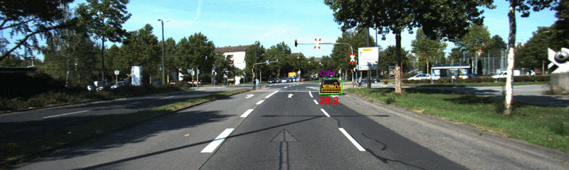
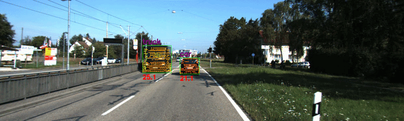
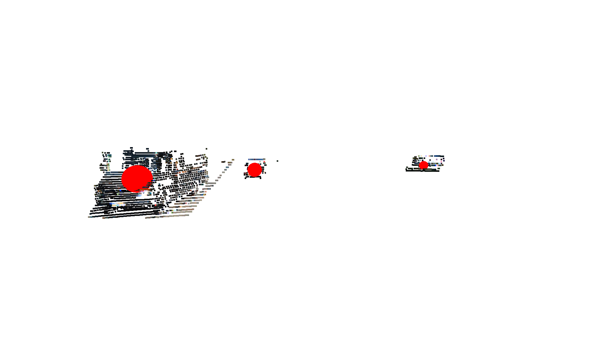
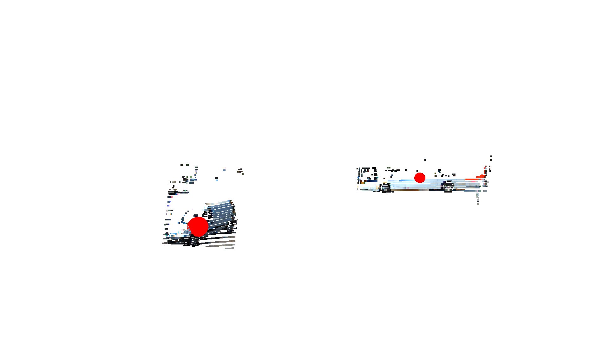

# KITTI 2D Object Detection and 3D Localization

2D object detection and 3D localization pipeline built in Python using YOLOv11, LiDAR depth sampling, and back-projection on the KITTI dataset.



---

## Overview

Object detection tells you what is in a image. Localization then tells you where it is in 3D space. Combining both types of information is fundamental to autonomous vehicle perception. A car needs to know not just that a pedestrian exists, but exactly how far away they are and in what direction.

This project runs YOLOv11 object detection across a 297-frame KITTI driving sequence, samples LiDAR depth returns within each detected bounding box to estimate object distance, and back-projects each detection into 3D camera coordinates using the inverse of the standard projection pipeline. The result is a unified visualization showing camera-frame detections with estimated 3D positions, depth-colored LiDAR point clusters per object, and Open3D markers localizing each detection in 3D space.

The pipeline builds directly on the projection math from my [LiDAR Camera Sensor Fusion](https://github.com/gsactown30/KITTI-lidar-camera-sensor-fusion) project, extending it in reverse — from image plane back into 3D space.

---

## Mathematical Foundation

### Forward Projection (Sensor Fusion Pipeline)

The full forward projection from LiDAR coordinates to image pixel coordinates is:

$$p_{image} = K \cdot [R \mid t] \cdot p_{lidar}$$

where $p_{lidar} = [x, y, z, 1]^T$ is a homogeneous LiDAR point, $[R \mid t]$ is the $3 \times 4$ extrinsic matrix transforming from LiDAR frame to camera frame, and $K$ is the $3 \times 4$ rectified projection matrix. The result is a homogeneous image point $[x, y, w]^T$, and final pixel coordinates are recovered via the perspective divide:

$$u = \frac{x}{w}, \quad v = \frac{y}{w}$$

### Back-Projection (This Project)

Given a detected pixel coordinate $(u, v)$ and an estimated depth $d$, we recover the 3D camera-frame position by inverting the intrinsic projection:

$$p_{cam} = d \cdot K^{-1} \cdot \begin{bmatrix} u \\ v \\ 1 \end{bmatrix}$$

where $K^{-1}$ is the $3 \times 3$ camera intrinsic matrix extracted from $P_{rect}$, and $d$ is the estimated metric depth in meters. The result $p_{cam} = [X, Y, Z]^T$ is the 3D position of the detection in camera coordinates, where $Z$ is forward depth, $X$ is lateral offset, and $Y$ is vertical offset (positive downward in KITTI convention).

### Depth Estimation from Sparse LiDAR

LiDAR returns projected onto the image plane are sparse — approximately 6% pixel coverage across the image, concentrated in the lower half where the scanner's elevation angles intersect the road scene. For a given bounding box $(x_1, y_1, x_2, y_2)$, valid LiDAR returns are isolated by:

$$\text{valid} = \{p_i \mid x_1 \leq u_i \leq x_2 \;\wedge\; y_1 \leq v_i \leq y_2\}$$

The representative depth is estimated as the **first quartile** $Q_1$ of valid depth values within the box. If fewer than $30$ valid returns exist, the detection is flagged and skipped.

---

## Key Engineering Decisions

**Why Q1 over minimum or median for depth estimation?**
Raw minimum is dangerous in sparse LiDAR data as ground plane returns that leak into the bottom of a bounding box, or backscatter noise, can produce depth values closer than the actual object. This would cause the vehicle to perceive an obstacle as closer than it is really is. Raw median undershoots safety for large objects like trucks, where the center of mass is significantly further than the leading edge. Q1 biases toward near returns — capturing the closest legitimate surface of the object — while rejecting the most extreme outliers. This is a tradeoff for safety and critical obstacle estimation.

**Why sparse LiDAR returns over the interpolated dense depth map?**
The sensor fusion project produced a dense $375 \times 1242$ interpolated depth map via `scipy.griddata`. For per-bounding-box depth sampling, the sparse nx6 projection array is preferred — it contains only real LiDAR returns, avoiding interpolated values that blend depth across object boundaries. This matters most at object edges where interpolation between foreground and background depths produces physically meaningless values.

**Why a minimum valid return threshold?**
Small or distant objects — particularly pedestrians and cyclists — may produce zero or near-zero LiDAR returns inside their bounding boxes due to the angle or the distance. Attempting back-projection with no valid returns would produce a garbage 3D position. Detections below the threshold are explicitly skipped rather than silently producing bad localizations.

**Confidence threshold of 0.5:**
A confidence threshold of 0.5 was used as it would not be as aggressive in filtering
while also maintaining a decent confidence integrity. This also allowed the program to run
at efficient speed without needing to process LiDAR points for low confidence objects.

---

## Implementation Details

For each generated image YOLO11 is run over it to generate bounding boxes of possible objects.
Using the forward projection pipeline, each corresponding LiDAR point cloud is filtered and converted
to image frame. A boolean mask is then created from the pixels bound by each bounding box and then used
to further filter the converted LiDAR points.
Additionally, a colormap is generated from the depth values converted from the original
LiDAR scan. From here labels are created based on object types as well as distance
calculated from back projection. Finally, LiDAR points are overlaid to create cohesive video.

---

## Results

Results were generated using KITTI sequence `2011_09_26_drive_0015` — 297 frames of urban driving.

### Detection and Depth Overlay Video



*297-frame sequence with YOLOv11 bounding boxes, class labels, estimated Q1 depth distance, and depth-colored LiDAR point overlays within each detected region.*

### 3D Localization in Open3D

*Fig 1*

*Fig 2*


*Filtered LiDAR point clusters for each detected object with red sphere markers at the back-projected 3D position estimate. Cluster density reflects LiDAR return sparsity — closer objects produce denser returns.*

---

## Installation

Python 3.11 required.

```bash
pip install pykitti open3d opencv-python numpy
```

### Dataset Setup

Download the KITTI raw dataset from https://www.cvlibs.net/datasets/kitti/raw_data.php.
Download the synced+rectified data and calibration files for sequence `2011_09_26_drive_0015`.

Organize the data as follows:

```
data/
└── kitti/
    └── 2011_09_26/
        ├── calib_cam_to_cam.txt
        ├── calib_imu_to_velo.txt
        ├── calib_velo_to_cam.txt
        └── 2011_09_26_drive_0015_sync/
            ├── image_02/
            ├── velodyne_points/
            └── oxts/
```

---

## Usage

```bash
python main.py
```


| Output | Description |
|--------|-------------|
| `fullDrive.mp4` | 297-frame detection video with bounding boxes, labels, and depth overlay |
| Open3D viewer | Per-frame 3D point clusters with back-projected detection markers |

---

## Future Work

- **Object tracking** — per-frame detection produces independent localizations with no temporal continuity. Kalman filtering with a data association step would link detections across frames into tracks, enabling velocity estimation and more robust localization through occlusion.
- **Depth estimation at range** — LiDAR return density drops sharply beyond ~30m, making Q1 estimation unreliable for distant objects. Learning-based depth completion or radar fusion would improve far-range localization.
- **3D bounding box estimation** — current localization is a single point estimate at the bounding box center. Fitting an oriented 3D bounding box to the LiDAR cluster would produce a more complete object representation consistent with standard AV perception outputs.
- **Class-specific depth strategies** — Q1 is a reasonable general strategy but optimal depth sampling may differ by class. Pedestrians are narrow and tall; trucks are wide and deep. Class-aware sampling regions could improve estimation accuracy per object type.

---

## Related Projects

This project is the third in a series building toward a full AV perception pipeline on the KITTI dataset:

1. [Occupancy Grid Mapping](https://github.com/gsactown30/OccupancyGridMapping) — Bayesian probabilistic mapping with log-odds updates and Bresenham ray casting
2. [LiDAR Camera Sensor Fusion](https://github.com/gsactown30/KITTI-lidar-camera-sensor-fusion) — Full projection pipeline, dense depth completion, RGB-colored 3D point clouds
3. [KITTI 2D Object Detection and 3D Localization](https://github.com/gsactown30/KITTI-2D-object-detection-and-3D-localization) — YOLO11 detection, LiDAR depth sampling, back-projection into 3D camera coordinates

---

## References

- Geiger, A., Lenz, P., Stiller, C., Urtasun, R. (2013). Vision meets Robotics: The KITTI Dataset. *International Journal of Robotics Research*.
- Jocher, G., et al. (2023). Ultralytics YOLO. https://github.com/ultralytics/ultralytics
- KITTI Raw Data. https://www.cvlibs.net/datasets/kitti/raw_data.php
- NumPy Documentation. https://numpy.org/doc/
- Open3D Documentation. https://www.open3d.org/docs/